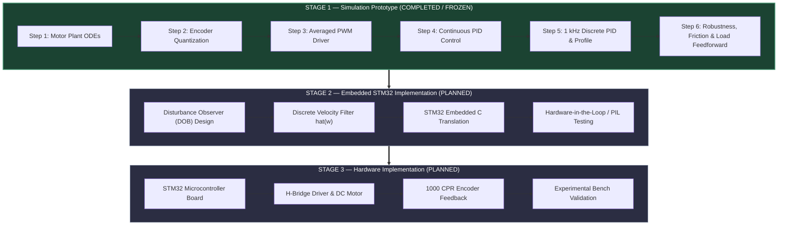
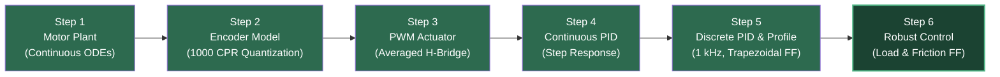

# STM32 Automated Precision Indexing & Feed Control System

A modeling, control design, and simulation baseline for precision rotary indexing tables, tool changers, and automated feed mechanisms driven by DC motor actuators.

---

## 1. Overview & Motivation
In automated manufacturing, CNC machinery, and robotics, precision rotary indexing tables and feed mechanisms are required to move an end-effector or workpiece to exact angular positions, hold that position under external cutting torques or load forces, and repeat the motion quickly without overshooting.

Achieving sub-degree positioning accuracy in a real electromechanical system is non-trivial. A practical motor system does not respond instantaneously to position commands. Instead, performance is governed by physical constraints:
* **Electrical dynamics:** Armature resistance ($R$) and inductance ($L$) limit current rise time.
* **Mechanical dynamics:** Rotor and load inertia ($J$) and viscous damping ($B$) dictate acceleration limits.
* **Actuation boundaries:** Driver power supplies ($V_{dc}$) impose hard voltage and duty cycle limits.
* **Measurement quantization:** Incremental optical encoders discretize continuous shaft angles into integer count steps.
* **Non-linear friction:** Static stiction breakaway torque and dynamic Coulomb sliding friction cause positioning deadbands and stick-slip motion.
* **External load disturbances:** Machining forces, part placement, or gravity torques corrupt position tracking during move and dwell phases.

This project develops a high-precision closed-loop position control architecture designed specifically for microcontroller deployment (such as the STM32 32-bit MCU platform). 

Currently, **Stage 1 (Simulink Simulation Prototype)** of the project is complete, fully verified, and frozen in this repository.

---

## 2. Problem Statement
In basic control textbooks, position control is often depicted as a simple linear feedback loop:

$$\text{Commanded Angle } \theta_{ref} \longrightarrow \text{Controller} \longrightarrow \text{Motor Plant} \longrightarrow \text{Position } \theta$$

In an actual precision indexing machine, the true signal flow involves several physical and discrete conversion boundaries:

```
Commanded Angle theta_ref
        │
        ▼
Trapezoidal Trajectory Generator (a_max, w_max)
        │
        ▼
Discrete Controller (1 kHz sampling, Ts = 1 ms)
        │
        ▼
PWM / Motor Drive (Duty cycle d in [0, 1], V_eff = d * V_dc)
        │
        ▼
DC Motor Electromechanical Plant (V_eff = L di/dt + R i + Ke w, T_e = Kt i)
        │
        ▼
Mechanical Shaft & Load Torque / Friction Integration (J d w/dt = T_e - T_L - T_fric - B w)
        │
        ▼
Optical Quadrature Encoder (Floor quantization floor(N_c))
        │
        ▼
Quantized Feedback Angle theta_enc (Feedback to Controller)
```

### Spatial Quantization Impact
Consider the 1000 CPR (Counts Per Revolution) optical encoder used in this system (derived from a 250 PPR quadrature optical disk):

$$\Delta \theta_{res} = \frac{360^\circ}{1000 \text{ counts}} = 0.3600^\circ/\text{count} \quad (0.006283185 \text{ rad/count})$$

Because the controller only observes the quantized angle $\theta_{enc}$, any physical position error below $0.3600^\circ$ produces zero encoder count changes. The controller cannot "see" sub-count deviations without additional integral action or feedforward compensation. Understanding and bounding these discrete quantization effects is critical before building hardware.

---

## 3. Proposed Solution
To achieve sub-degree indexing accuracy and zero overshoot without relying on trial-and-error hardware tuning, the proposed solution follows a structured three-phase development methodology:

1. **Model-Based Simulation (Stage 1):** Derive continuous motor plant differential equations, model encoder spatial quantization, simulate averaged PWM voltage limits, and design a discrete 1 kHz PID controller augmented with kinematic profile feedforward and physics-based disturbance/friction compensation.
2. **Embedded MCU Transition (Stage 2 — Planned):** Translate validated control algorithms into fixed-point/floating-point C code for STM32 microcontrollers, replacing simulation-level oracle signals with a real-time **Disturbance Observer (DOB)** and discrete velocity filters.
3. **Physical Hardware Validation (Stage 3 — Planned):** Deploy the C firmware onto an STM32 MCU board interfaced with an H-Bridge driver, DC gearmotor, and optical quadrature encoder to measure real-world performance against the simulation baseline.

---

## 4. Why Simulation Before Hardware?
Attempting to tune high-gain position controllers directly on physical hardware often leads to confusing diagnostics. When a physical motor overshoots, oscillates, or exhibits steady-state error, it is difficult to isolate whether the root cause is:
* Controller gain instability
* Encoder quantization chatter
* PWM duty cycle saturation
* MCU sampling jitter or timing delays
* Mechanical backlash, friction, or flexure
* Voltage drops in the driver power supply

By building and validating **Stage 1 as a baseline simulation prototype**, every dynamic block is isolated and verified independently. The exact mathematical limits of the controller are established in a controlled environment before physical hardware constraints are introduced.

---

## 5. Complete Project Roadmap



> **Current Repository Scope Notice:**  
> This repository contains **STAGE 1 ONLY**. Stages 2 and 3 are future roadmap milestones.

---

## 6. Stage 1 — Simulation Prototype Architecture

Stage 1 consists of six progressive technical steps executed in MATLAB/Simulink:



### Breakdown of Stage 1 Steps

#### Step 1 — Electromechanical DC Motor Plant
* **Focus:** Continuous-time differential equations governing motor electrical and mechanical dynamics.
* **Equations:**
  $$\frac{di}{dt} = \frac{1}{L} \left( V_{eff}(t) - R \cdot i(t) - K_e \cdot \omega(t) \right)$$
  $$\frac{d\omega}{dt} = \frac{1}{J} \left( K_t \cdot i(t) - B \cdot \omega(t) - T_L(t) \right)$$
* **Verification:** Applied step input voltage $V_{app} = 12.0\text{ V}$. Steady-state speed reached $\omega_{ss} = 239.4710\text{ rad/s}$ ($2286.78\text{ RPM}$), matching analytical derivation within $0.0209\%$ relative error.

#### Step 2 — Encoder Measurement & Spatial Quantization
* **Focus:** Modeling finite spatial resolution using a 250 PPR quadrature optical encoder ($1000\text{ CPR}$).
* **Quantization Logic:**
  $$N_{count}[k] = \left\lfloor \theta_{true}(t) \cdot \frac{1000}{2\pi} \right\rfloor, \quad \theta_{enc}[k] = N_{count}[k] \cdot \frac{2\pi}{1000}$$
* **Verification:** True shaft angle vs. quantized encoder angle verified under open-loop step motion. Position error is strictly bounded by $|e_{true}| \le 0.3599^\circ \le 0.3600^\circ$ ($1.0\text{ count}$).

#### Step 3 — Averaged PWM H-Bridge Driver Model
* **Focus:** Duty cycle scaling $d(t) \in [0.0, 1.0]$ mapped to effective terminal voltage $V_{eff} = d \cdot V_{dc}$ ($V_{dc} = 12.0\text{ V}$).
* **Verification:** Step duty cycle inputs $d = 0.75$ ($9.0\text{ V}$) and $d = 1.00$ ($12.0\text{ V}$) confirmed perfect linear speed scaling with $0.0000\%$ ratio error.

#### Step 4 — Continuous Closed-Loop Position Control
* **Focus:** Continuous parallel PID controller ($K_p = 1.0, K_i = 0.10, K_d = 0.050, N = 1000$) driving unprofiled 90° step command.
* **Verification:** Achieved $0.00\%$ overshoot, 2% settling time $t_s = 78.4\text{ ms}$, and final steady-state error $0.0384^\circ \le 0.3600^\circ$ ($0.11\text{ counts}$).

#### Step 5 — 1 kHz Discrete Trajectory Control & Multi-Move Indexing
* **Focus:** Discretizing the control loop to $1\,\text{kHz}$ ($T_s = 1\,\text{ms}$), adding a trapezoidal kinematic profile generator ($a_{\max} = 50\,\text{rad/s}^2$, $\omega_{\max} = 8\,\text{rad/s}$), implementing conditional anti-windup integration clamping, and adding velocity and acceleration feedforward gains ($K_{ff,v}$, $K_{ff,a}$).
* **Verification:** Dynamic tracking error was limited to **0.4456°** (target: ≤ 1.7200°), peak armature current was **0.0506 A** (limit: ≤ 1.50 A), and the maximum positioning error across three sequential moves was **0.1247°**.

#### Step 6 — Robustness, Disturbance Rejection & Non-Linear Friction Analysis
* **Focus:** Stress-testing the discrete controller under in-motion step load disturbance ($T_L = 0.010\text{ N}\cdot\text{m}$ at $t=0.20\text{s}$), in-dwell pulse disturbance ($t=0.60\text{s}$), continuous Stribeck friction ($T_{stick} = 0.0020\text{ N}\cdot\text{m}, T_{coulomb} = 0.0010\text{ N}\cdot\text{m}$), and payload inertia sweeps ($1\times, 2\times, 3\times J_0$).
* **Feedforward Additions:**
  * Physics load feedforward: $K_{ff,L} = \frac{R}{V_{dc} \cdot K_t} = 0.833333\text{ N}^{-1}\cdot\text{m}^{-1}$
  * Continuous friction feedforward: $u_{ff,fric}(\omega_{ref}) = K_{ff,L} \cdot \left[ T_{coulomb} + (T_{stick} - T_{coulomb}) e^{-(\omega_{ref}/\omega_s)^2} \right] \cdot \tanh(1000 \cdot \omega_{ref})$
* **Verification:** In-motion error bounded at $0.5218^\circ$, in-dwell pulse deviation held to $0.2786^\circ \le 0.3600^\circ$ ($0\text{ ms}$ recovery time), final friction true position error $0.1512^\circ$ ($0\text{ encoder counts}$), and $3\times J_0$ inertia sweep tracking error held to $0.7201^\circ \le 1.7200^\circ$.

---

## 7. How the Stage 1 Prototype Works
The complete Stage 1 control loop functions as an integrated discrete-continuous hybrid system:

```
                                              +-------------------------------------------------------------+
                                              |                   PHYSICAL FEEDFORWARD                      |
                                              |  u_ff,v = Kff_v * w_ref    u_ff,a = Kff_a * a_ref           |
                                              |  u_ff,L = Kff_L * TL_est   u_ff,fric = f(w_ref)             |
                                              +------------------------------+------------------------------+
                                                                             |
                                                                             v
+-----------------------+     theta_ref     +------------------+  u_pid   +---+  u_total  +----------------+  V_eff  +-----------------+
| Trapezoidal Kinematic |------------------>| Discrete PID     |--------->| + |---------->| Averaged PWM   |-------->| Electromechanical|
| Profile Generator     |  w_ref, a_ref     | Controller       |          +---+           | H-Bridge Model |         | DC Motor Plant  |
+-----------------------+   (1 kHz)         | (Ts = 1 ms)      |            ^             +----------------+         +--------+--------+
                                            +------------------+            |                                                | w(t), theta_true
                                                      ^                     | Load Disturbance T_L(t)                        v
                                                      |                     v Striction & Coulomb Friction         +------------------+
                                                      |             +---------------+                              | 1000 CPR Optical |
                                                      +-------------| Quantization  |<-----------------------------| Quadrature       |
                                                       theta_enc    | floor(N_c)    |          theta_true          | Encoder          |
                                                                    +---------------+                              +------------------+
```

1. **Trajectory Planning:** The profile generator computes continuous reference position $\theta_{ref}(t)$, velocity $\omega_{ref}(t)$, and acceleration $a_{ref}(t)$ commands constrained by kinematic bounds.
2. **Error Calculation:** The discrete PID controller calculates position error $e[k] = \theta_{ref}[k] - \theta_{enc}[k]$ using **only the quantized encoder measurement** $\theta_{enc}[k]$.
3. **Feedforward Summation:** Model-based feedforward terms ($u_{ff,v}, u_{ff,a}, u_{ff,L}, u_{ff,fric}$) are summed directly with PID control voltage $u_{pid}[k]$.
4. **Actuator Saturation:** Total control effort $u_{total}[k]$ is normalized into duty cycle $d[k] \in [0.0, 1.0]$, driving the continuous motor plant via effective voltage $V_{eff} = d \cdot V_{dc}$.
5. **Plant Dynamics & Feedback:** Motor continuous equations integrate true shaft position $\theta_{true}(t)$, which is floor-quantized by the 1000 CPR encoder model to form feedback $\theta_{enc}[k+1]$.

---

## 8. Stage 1 Verification & Results

Every step in Stage 1 was evaluated in MATLAB R2025a using ODE45 simulations and validated against quantitative limits:

| Step | Technical Objective | Key Measured Simulation Metric | Target / Acceptance Limit | Verdict |
| :---: | :---: | :---: | :---: | :---: |
| **1** | Motor Plant Steady-State Speed | $\omega_{ss} = 239.4710\,\text{rad/s}$ ($2286.78\,\text{RPM}$) | Relative Speed Error $\leq 0.05\%$ ($0.0209\%$ err) | **PASS** |
| **2** | Encoder Quantization Bound | $\lvert e_{\text{true}}\rvert_{\max} = 0.3599^\circ$ | Position Error $\leq 1.0$ count ($0.3600^\circ$) | **PASS** |
| **3** | Averaged PWM Actuation Linearity | $d = 0.75 \implies \omega_{ss} = 179.6033\,\text{rad/s}$ | Linearity Ratio Error $\leq 0.01\%$ ($0.0000\%$ err) | **PASS** |
| **4** | Continuous Closed-Loop Step Response | Overshoot $= 0.00\%$, $t_s = 78.4\,\text{ms}$, $e_{ss} = 0.0384^\circ$ | Overshoot $< 2.0\%$, $e_{ss} \leq 0.3600^\circ$ | **PASS** |
| **5** | 1 kHz Discrete PID Trajectory Profiling | $\lVert e_{\text{true}}\rVert_{\max} = 0.4456^\circ$, $i_{\text{peak}} = 0.0506\,\text{A}$ | $\lVert e\rVert_{\max} \leq 1.7200^\circ$, $i_{\text{peak}} \leq 1.50\,\text{A}$ | **PASS** |
| **6** | Disturbance, Friction & Inertia | In-motion error $0.5218^\circ$, pulse deviation $0.2786^\circ$ ($0\,\text{ms}$ recovery) | Pulse Deviation $\leq 0.3600^\circ$, $t_{\text{rec}} \leq 50\,\text{ms}$, $3\times J_0$ pass | **PASS** |

---

## 9. Current Limitations & Prototype Assumptions
To maintain full technical credibility, the following simulation-prototype boundaries are explicitly documented:

1. **Direct Load Torque Feedforward ($T_{L,est}$):** In Step 6, load feedforward ($u_{ff,L} = K_{ff,L} \cdot T_{L,est}$) relies on direct knowledge of the load disturbance torque. This is acceptable for a software simulation prototype. Stage 2 will replace this oracle signal with a sensorless **Disturbance Observer (DOB)**.
2. **Reference Velocity Friction Feedforward ($\omega_{ref}$):** Stribeck friction cancellation uses ideal profile velocity $\omega_{ref}$ during dwell to prevent encoder quantization noise amplification. Stage 2 will introduce discrete velocity filtering for measured speed $\hat{\omega}$.
3. **Idealized Power Electronics:** The PWM H-Bridge driver uses averaged voltage scaling ($V_{eff} = d \cdot V_{dc}$) without simulating MOSFET switching dead-time or high-frequency switching harmonics.
4. **Absence of Hardware:** Stage 1 contains no physical C code, STM32 HAL drivers, or hardware bench measurements.

---

## 10. Repository Structure

```text
Project/
│
├── README.md                           # Master GitHub documentation & roadmap (this file)
├── LICENSE                             # Project software license file
├── .gitignore                          # Production ignore rules for MATLAB/Simulink/Python cache
├── run_stage1.m                        # Top-level single-command execution entry point
├── test_stage1.m                       # Top-level automated regression test entry point
│
├── models/                             # Simulink models (.slx)
│   ├── stage1_motor_plant.slx          # Step 1: Motor electromechanical plant ODE model
│   ├── stage1_encoder_model.slx        # Step 2: 1000 CPR encoder floor quantization model
│   ├── stage1_pwm_model.slx            # Step 3: Averaged PWM H-bridge driver model
│   ├── stage1_closed_loop_model.slx    # Step 4: Continuous parallel PID position model
│   ├── stage1_profiled_loop_model.slx   # Step 5: 1 kHz discrete PID + trapezoidal profile model
│   └── stage1_robust_loop_model.slx     # Step 6: Robust PID + load & Stribeck friction model
│
├── scripts/                            # MATLAB & Python automation scripts
│   ├── params.m                        # Central master system parameters
│   ├── run_stage1.m                    # Authoritative execution script
│   ├── test_stage1.m                   # Authoritative automated regression test script
│   ├── build_and_run_stage1.m ... stage6.m # Step-by-step verification scripts
│   └── generate_stage2_plots.py ... stage6.py # Figure dashboard plot generators
│
├── results/stage1/                     # Executable simulation datasets (.mat)
│   └── stage1_data.mat ... stage6_data.mat
│
├── plots/stage1/                       # High-resolution figure dashboards (.png)
│   └── 20 publication-quality PNG figure dashboards
│
|── Glossary
|
├── License                             # MIT License         
```


## 11. Future Work Roadmap (Stage 2 & Stage 3)

### Stage 2 — Embedded STM32 Implementation (Planned)
* **Sensorless Load Observer:** Implement a Luenberger Disturbance Observer (DOB) to estimate load torque $T_{L,est}$ directly from armature current and measured velocity.
* **Velocity Estimation:** Implement discrete differentiation and low-pass filtering to derive measured shaft velocity $\hat{\omega}$.
* **C Firmware Translation:** Convert discrete PID and feedforward algorithms into 32-bit floating-point C code (`float32_t`) targeted for ARM Cortex-M microcontrollers (STM32F4/G4 series).
* **Processor-in-the-Loop (PIL):** Validate real-time code execution timing and numerical precision against Stage 1 simulation baselines.

### Stage 3 — Physical Hardware Validation (Planned)
* Interfacing STM32 MCU board with an H-Bridge motor driver module (e.g., L298N / VNH5019).
* Interfacing 250 PPR optical quadrature encoder with STM32 hardware timer encoder mode.
* Benchmarking real-world physical positioning accuracy, overshoot, settling time, and disturbance rejection against Stage 1 simulation predictions.

---

## 12. Technical Glossary

A technical glossary is included in the repository for quick reference to the symbols, abbreviations, parameters, and terminology used throughout the project.

📘 **[View the Technical Glossary](GLOSSARY.md)**

Refer to this file when reading the MATLAB scripts, Simulink models, or Stage 1 documentation.


## 13. License & Citation
This project is released under the open-source MIT License. See [LICENSE](LICENSE) for details.
