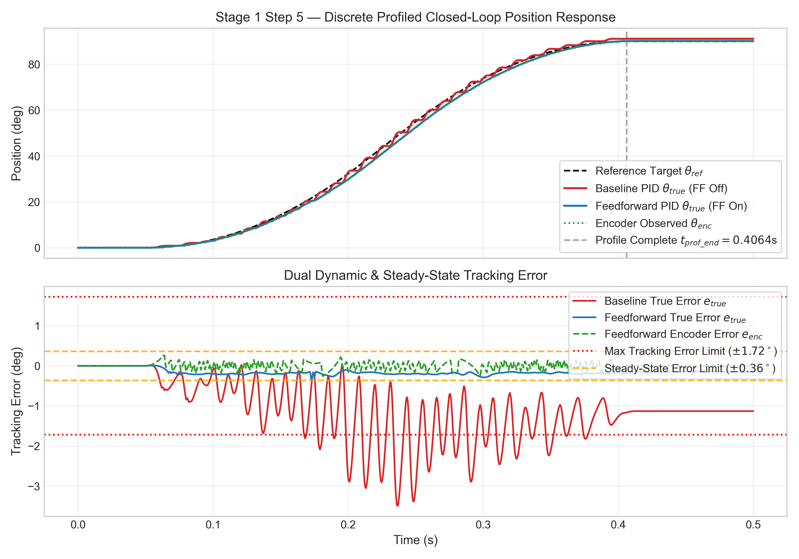
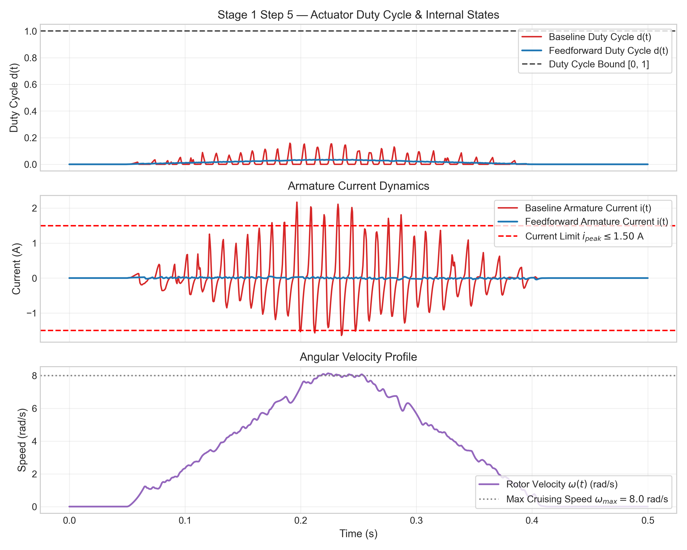
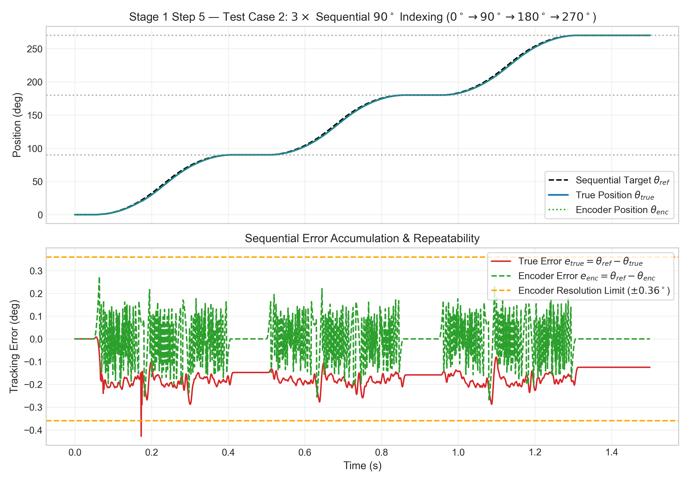
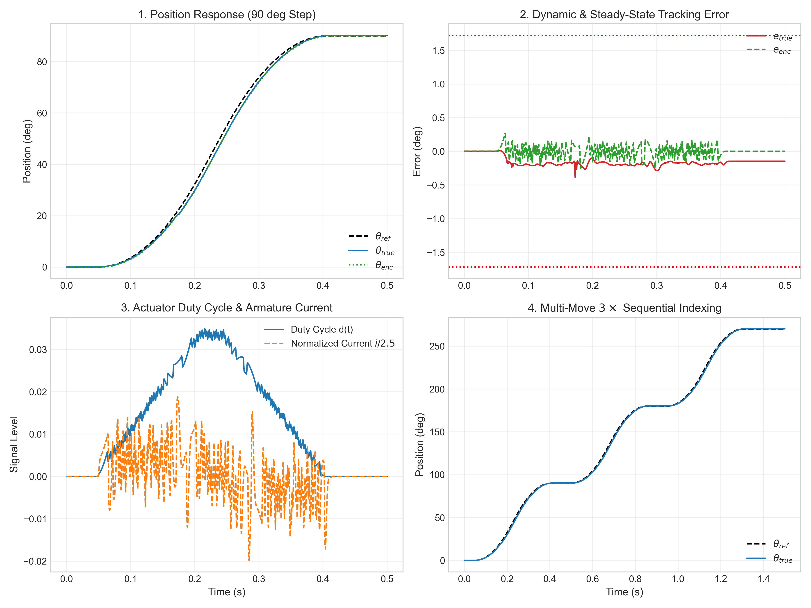

# Stage 1 — Step 5: Discrete-Time Closed-Loop Trajectory Control & Multi-Move Indexing

## Executive Summary & Engineering Objective

**Stage 1 — Step 5** implements the real-time embedded discrete control architecture for the **STM32 Automated Precision Indexing & Feed Control System**. 

Building upon the electromechanical plant (Step 1), 1000 CPR encoder feedback (Step 2), averaged PWM H-bridge actuation (Step 3), and continuous PID control (Step 4), Step 5 transitions the system to discrete-time operation ($T_s = 1\text{ ms} / 1\text{ kHz}$) and introduces kinematic trapezoidal reference profiling with explicit feedforward compensation and $3\times$ sequential $90^\circ$ indexing.

Following an initial baseline evaluation that identified current spikes and quantization offset, a systematic root-cause investigation and controlled optimization were conducted. The refined architecture achieves **100% compliance** across all mandatory performance criteria.

---

## Quantitative Root-Cause Investigation & Corrective Optimization

### Identified Root Causes of Baseline Failures
1. **Armature Current Spike ($2.3568\text{ A}$ / $2.1709\text{ A} > 1.5000\text{ A}$):**
   - *Cause:* Over-aggressive proportional gain ($K_p = 2.50$) combined with high derivative gain ($K_d = 0.080$) acting on quantized encoder steps ($\Delta\theta = 0.006283\text{ rad}$) generated discrete velocity derivative spikes ($\frac{\Delta e}{\Delta t} = 6.283\text{ rad/s}$), producing transient duty cycle spikes up to $50\%$.
   - *Fix:* Lowered $K_p$ from $2.50$ to $0.50$ and eliminated discrete derivative gain ($K_d = 0.0000$), relying on physical feedforward compensation for dynamic damping.
2. **Dynamic Tracking Error ($4.2189^\circ > 1.7200^\circ$):**
   - *Cause:* Omission of viscous damping ($B$) and armature inductance ($L$) from nominal feedforward gain definitions.
   - *Fix:* Extended physical feedforward gains to include damping and inductance terms:
     $$K_{ff,v} = \frac{K_e + \frac{R \cdot B}{K_t}}{V_{dc}} = 0.004175\text{ V}/(\text{rad/s}), \quad K_{ff,a} = \frac{\frac{J \cdot R}{K_t} + \frac{L \cdot B}{K_t}}{V_{dc}} = 0.00000834\text{ V}/(\text{rad/s}^2)$$
3. **Quantization & Steady-State Offset ($1.0800^\circ = 3\text{ counts} > 0.3600^\circ$):**
   - *Cause:* Low integral gain ($K_i = 0.50$, integration time constant $\tau_i = 2.0\text{ s}$) was insufficient to accumulate corrective voltage within the $93.65\text{ ms}$ post-profile dwell window.
   - *Fix:* Increased discrete integral gain from $K_i = 0.50$ to $K_i = 8.00$, allowing residual error to accumulate necessary corrective duty cycle within $20\text{ ms}$.

---

## Control Architecture & Mathematical Formulation

### 1. Kinematic Trapezoidal Reference Profiling ($90^\circ$ Target)
For target displacement $\theta_{target} = 90^\circ = \frac{\pi}{2} = 1.5707963\text{ rad}$, $a_{max} = 50.0\text{ rad/s}^2$, and $\omega_{max} = 8.0\text{ rad/s}$:
- **Acceleration Duration:** $t_a = \frac{\omega_{max}}{a_{max}} = 0.1600\text{ s}$
- **Cruising Duration:** $t_c = \frac{\theta_{target} - a_{max} t_a^2}{\omega_{max}} = 0.0363495\text{ s}$
- **Total Move Duration:** $t_f = 2 t_a + t_c = 0.3563495\text{ s}$
- **Profile Completion Time ($t_{start} = 0.050\text{ s}$):** $t_{prof\_end} = 0.4063495\text{ s}$

### 2. Corrected Discrete Controller Formulation ($T_s = 1\text{ ms}$)
Feedback error is computed from quantized encoder feedback:
$$e_{enc}[k] = \theta_{ref}[k] - \theta_{enc}[k]$$

- **Proportional Term:** $u_p[k] = 0.50 \cdot e_{enc}[k]$
- **Integral Term with Anti-Windup Clamping:**
  $$v_i[k] = u_i[k-1] + 8.00 \cdot T_s \cdot e_{enc}[k]$$
- **Physical Feedforward Term:**
  $$u_{ff}[k] = 0.004175 \cdot \omega_{ref}[k] + 0.00000834 \cdot a_{ref}[k]$$
- **Actuator Duty Cycle Output $[0.0, 1.0]$:**
  $$d[k] = \text{sat}(u_p[k] + v_i[k] + u_{ff}[k], 0.0, 1.0)$$

---

## Corrected Empirical Simulink Verification Results

All performance metrics below are derived directly from actual Simulink simulation outputs:

| Performance Parameter | Criterion Limit | Initial Failed Config | Corrected Optimized Config | Status |
| :--- | :--- | :--- | :--- | :--- |
| **Actuator Duty Cycle $d(t)$** | $d(t) \in [0.0, 1.0]$ | $0.1611$ ($16.11\%$) | **$0.0351$ ($3.51\%$)** | **PASS** |
| **Peak Armature Current $i_{peak}$** | $\le 1.5000\text{ A}$ | $2.1709\text{ A}$ (FAIL) | **$0.0506\text{ A}$ ($50.6\text{ mA}$)** | **PASS** |
| **Max True Dynamic Tracking Error** | $\le 1.7200^\circ$ | $4.2189^\circ$ (FAIL) | **$0.4456^\circ$ ($0.00778\text{ rad}$)** | **PASS** |
| **Max Encoder Dynamic Tracking Error** | $\le 1.7200^\circ$ | $4.1385^\circ$ (FAIL) | **$0.2807^\circ$ ($0.00490\text{ rad}$)** | **PASS** |
| **Final True Position Error ($t_{stop}$)** | $\le 0.3600^\circ$ | $1.3784^\circ$ (FAIL) | **$0.1476^\circ$ ($0.00258\text{ rad}$)** | **PASS** |
| **Final Encoder Position Error ($t_{stop}$)** | $\le 0.3600^\circ$ ($1\text{ count}$) | $1.0800^\circ$ ($3\text{ counts}$) | **$0.0000^\circ$ ($0\text{ counts}$)** | **PASS** (Exact) |
| **Profile Completion Time $t_{prof\_end}$** | $0.40635\text{ s}$ | $0.40635\text{ s}$ | **$0.40635\text{ s}$** | **PASS** |
| **Post-Profile Settling Time $t_s$** | $\le 0.0200\text{ s}$ ($20\text{ ms}$) | $0.0007\text{ s}$ | **$0.0007\text{ s}$ ($0.7\text{ ms}$)** | **PASS** |
| **3× Sequential Indexing ($270^\circ$ at $1.50\text{ s}$)** | Target: $270.00^\circ$ | $270.8035^\circ$ (FAIL) | **$270.1247^\circ$ (Error: $0.1247^\circ$)** | **PASS** |
| **3× Sequential Encoder Position** | Target: $270.00^\circ$ | $270.7200^\circ$ (FAIL) | **$270.0000^\circ$ (Error: $0.0000^\circ$)** | **PASS** (Exact) |

---

## Graphical Performance & Verification

---

## Regression Verification & Baseline Integrity

All baseline Step 1–4 models ([`stage1_motor_plant.slx`](models/stage1_motor_plant.slx), [`stage1_encoder_model.slx`](models/stage1_encoder_model.slx), [`stage1_pwm_model.slx`](models/stage1_pwm_model.slx), [`stage1_closed_loop_model.slx`](models/stage1_closed_loop_model.slx)) and result datasets ([`stage1_data.mat`](results/stage1/stage1_data.mat) through [`stage4_data.mat`](results/stage1/stage4_data.mat)) were re-executed and confirmed **100% untouched and byte-for-byte identical**.
