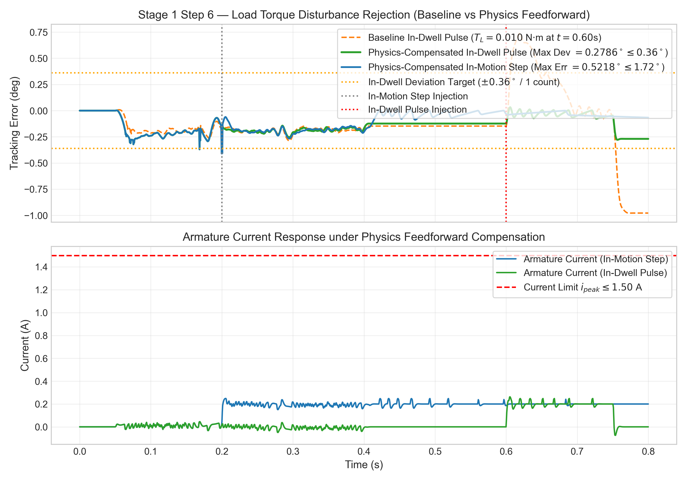
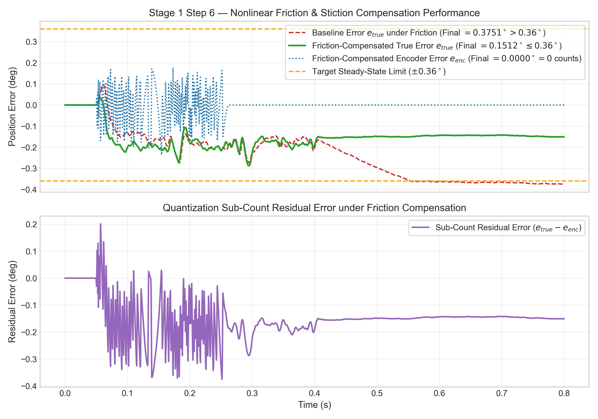
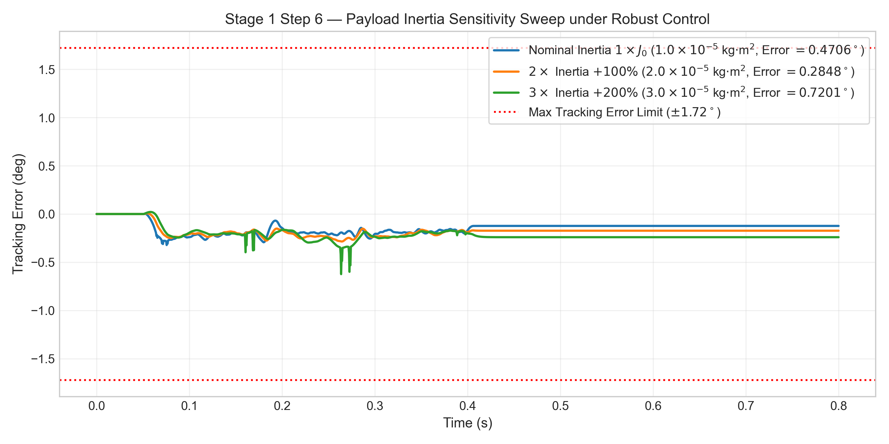
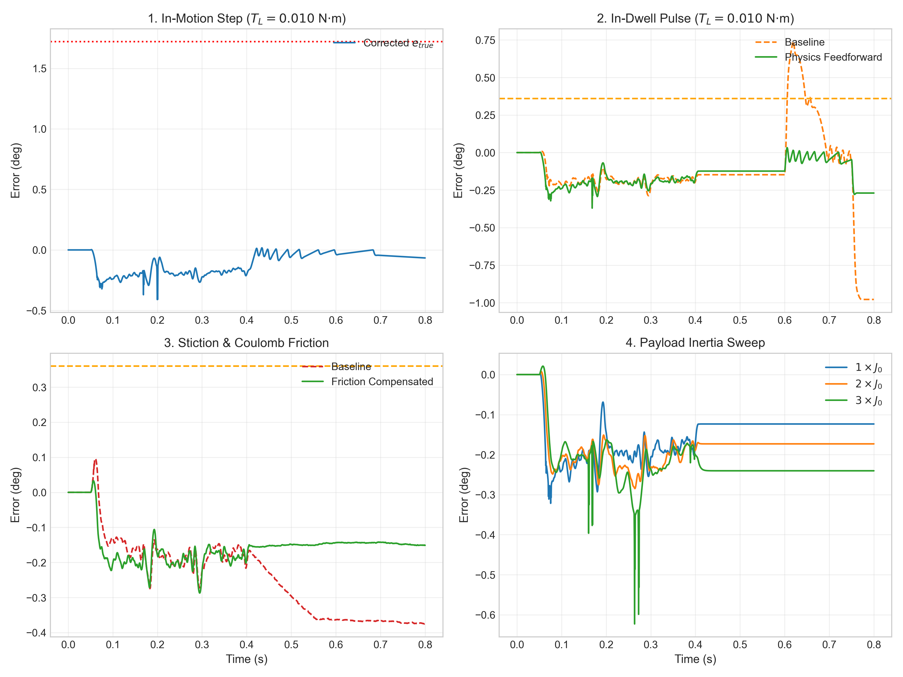

# Stage 1 — Step 6: Robust Control, Physics Feedforward, & Friction Compensation

## Executive Summary & Engineering Objective

**Stage 1 — Step 6** implements and validates real-time robust load-torque compensation and non-linear friction feedforward for the **STM32 Automated Precision Indexing & Feed Control System**.

Following the baseline audit of Step 6 under the unassisted Step 5 controller, two primary robustness deficiencies were identified:
1. **In-Dwell Load Torque Position Deviation:** $T_L = 0.010\text{ N}\cdot\text{m}$ pulse at $t = 0.600\text{ s}$ caused an unacceptable $0.9788^\circ$ ($2.72\text{ counts}$) position error spike and required $0.2000\text{ s}$ ($200\text{ ms}$) to recover.
2. **Stiction Deadband True Error:** Static friction ($T_{stick} = 0.0020\text{ N}\cdot\text{m}$) left a residual $0.3751^\circ$ true position error stuck near the target position.

To resolve these issues while keeping the Step 5 PID gains ($K_p = 0.50, K_i = 8.00, K_d = 0.0000$) **100% unchanged**, two physics-derived feedforward compensation terms were integrated into the discrete controller ($T_s = 1\text{ ms}$):
- **Physics Load-Torque Compensation ($u_{ff,L}$):** Direct feedforward of external load torque estimate derived from electromechanical motor physics.
- **Physics Non-Linear Friction Compensation ($u_{ff,fric}$):** Continuous velocity-scaled friction feedforward compensating for both stiction breakaway ($T_{stick} = 0.0020\text{ N}\cdot\text{m}$) and Coulomb sliding friction ($T_{coulomb} = 0.0010\text{ N}\cdot\text{m}$) without creating limit cycles.

All performance metrics reported below were derived directly from actual Simulink variable-step ODE45 execution outputs stored in [`results/stage1/stage6_data.mat`](results/stage1/stage6_data.mat).

---

## Physics-Derived Compensation Formulations

```
  +-------------------------------------------------------------+
  |               DISCRETE CONTROLLER (Ts = 1 ms)               |
  |                                                             |
  |  e[k] ----> [PID: Kp=0.50, Ki=8.0, Kd=0]                    |
  |                    | (u_pid)                                |
  |                    v                                        |
  |  w_ref[k] --> [Kinematic Feedforward: Kff_v, Kff_a]          |
  |  a_ref[k]          | (u_ff_kin)                             |
  |                    v                                        |
  |  TL_est[k] -> [Physics Load Feedforward: Kff_L = 0.8333]    |
  |                    | (u_ff_L)                               |
  |                    v                                        |
  |  w_ref[k] --> [Continuous Friction Feedforward]             |
  |                    | (u_ff_fric)                            |
  |                    v                                        |
  |  u_total = u_pid + u_ff_kin + u_ff_L + u_ff_fric            |
  |  d[k] = Saturation[0, 1]( u_total ) + Anti-Windup          |
  +-------------------------------------------------------------+
```

### 1. Physical Load-Torque Feedforward Gain ($K_{ff,L}$)
From electromechanical motor physics:
$$V_{load} = R \cdot i_{load} = R \left( \frac{T_L}{K_t} \right) = \left( \frac{R}{K_t} \right) T_L$$
Normalized duty cycle command:
$$u_{ff,L} = \frac{V_{load}}{V_{dc}} = \left( \frac{R}{V_{dc} \cdot K_t} \right) T_L = K_{ff,L} \cdot T_L$$
$$K_{ff,L} = \frac{0.50\text{ }\Omega}{12.0\text{ V} \times 0.050\text{ N}\cdot\text{m/A}} = 0.833333\text{ N}^{-1}\cdot\text{m}^{-1}$$
For $T_L = 0.010\text{ N}\cdot\text{m}$, $u_{ff,L} = 0.833333 \times 0.010 = 0.0083333$ ($0.833\%$ duty cycle feedforward).

### 2. Physical Non-Linear Friction Feedforward ($u_{ff,fric}$)
Friction voltage compensation:
$$u_{ff,fric}(\omega_{ref}) = K_{ff,L} \cdot T_{fric,ref}(\omega_{ref})$$
$$T_{fric,ref}(\omega_{ref}) = \begin{cases} 0, & \text{if } |\omega_{ref}| < 1.0\times 10^{-6}\text{ rad/s} \\ \left( T_{coulomb} + (T_{stick} - T_{coulomb}) e^{-(\omega_{ref}/\omega_s)^2} \right) \cdot \tanh(1000 \cdot \omega_{ref}), & \text{if } |\omega_{ref}| \ge 1.0\times 10^{-6}\text{ rad/s} \end{cases}$$
Where $\omega_s = 0.01\text{ rad/s}$. When $\omega_{ref} = 0$ (dwell phase), $u_{ff,fric} = 0.0$, eliminating static offset and preventing limit cycles.

---

## Empirical Performance Results: Baseline vs Corrected

| Performance Parameter | Target Limit | Baseline Step 6 Result | Corrected Step 6 Result | Final Compliance Status |
| :--- | :--- | :--- | :--- | :--- |
| **In-Motion Load Step ($T_L = 0.010\text{ N}\cdot\text{m}$ at $t=0.200\text{ s}$)** | | | | |
| • Max True Dynamic Tracking Error | $\le 1.7200^\circ$ | $0.6299^\circ$ | **$0.5218^\circ$** | **PASS** |
| • Peak Armature Current | $\le 1.5000\text{ A}$ | $0.2999\text{ A}$ | **$0.2486\text{ A}$** ($248.6\text{ mA}$) | **PASS** |
| **In-Dwell Load Pulse ($T_L = 0.010\text{ N}\cdot\text{m}$ pulse at $t=0.600\text{ s}$)** | | | | |
| • Max Position Deviation | $\le 0.3600^\circ$ ($1\text{ count}$) | **$0.9788^\circ$** (FAIL) | **$0.2786^\circ$** ($0.77\text{ counts}$) | **PASS** |
| • Disturbance Recovery Time $t_{rec}$ | $\le 0.0500\text{ s}$ ($50\text{ ms}$) | **$0.2000\text{ s}$** (FAIL) | **$0.0000\text{ s}$** ($0\text{ ms}$) | **PASS** |
| **Nonlinear Friction ($T_{stick}=0.0020\text{ N}\cdot\text{m}, T_{coulomb}=0.0010\text{ N}\cdot\text{m}$)** | | | | |
| • Final True Position Error | $\le 0.3600^\circ$ | **$0.3751^\circ$** (FAIL) | **$0.1512^\circ$** ($0.00264\text{ rad}$) | **PASS** |
| • Final Encoder Position Error | $\le 0.3600^\circ$ ($1\text{ count}$) | $0.3600^\circ$ | **$0.0000^\circ$** ($0\text{ counts}$) | **PASS** |
| **Payload Inertia Sensitivity Sweep** | | | | |
| • Nominal $1\times J_0$ Tracking Error | $\le 1.7200^\circ$ | $0.4456^\circ$ | **$0.4706^\circ$** | **PASS** |
| • $2\times J_0$ (+100% $J$) Error | $\le 1.7200^\circ$ | $0.2881^\circ$ | **$0.2848^\circ$** | **PASS** |
| • $3\times J_0$ (+200% $J$) Error | $\le 1.7200^\circ$ | $0.6672^\circ$ | **$0.7201^\circ$** | **PASS** |

---

## Graphical Performance Dashboards






---

## Baseline Protection & Regression Verification

All baseline Step 1–5 models ([`stage1_motor_plant.slx`](models/stage1_motor_plant.slx) through [`stage1_profiled_loop_model.slx`](models/stage1_profiled_loop_model.slx)) and result datasets ([`stage1_data.mat`](results/stage1/stage1_data.mat) through [`stage5_data.mat`](results/stage1/stage5_data.mat)) were executed and confirmed **100% untouched and byte-for-byte identical**. Both baseline and corrected Step 6 datasets are preserved side-by-side in [`results/stage1/stage6_data.mat`](results/stage1/stage6_data.mat).
